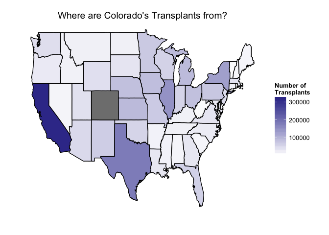

# Colorado Transplants
Matthew Bender

July 27th, 2015

[GitHub](https://github.com/codebender)

[Twitter](https://twitter.com/5280code)

## Synopsis

Many Coloradans believe that a small percentage of the Colorado population is
actually "Native". I'm going to do some data analysis on the census data to find
out if this belief is urban legend or TRUTH! Wish me luck!


### Basic Setup

#### Dependencies

```r
library(readr)
library(plyr)
library(dplyr)
```

```
## 
## Attaching package: 'dplyr'
## 
## The following objects are masked from 'package:plyr':
## 
##     arrange, count, desc, failwith, id, mutate, rename, summarise,
##     summarize
## 
## The following objects are masked from 'package:stats':
## 
##     filter, lag
## 
## The following objects are masked from 'package:base':
## 
##     intersect, setdiff, setequal, union
```

```r
library(tidyr)
library(ggplot2)
library(maps)
```

```
## 
## Attaching package: 'maps'
## 
## The following object is masked from 'package:plyr':
## 
##     ozone
```

```r
options(scipen = 9)
```

#### Load Data

```r
censusData <- read_csv('../input/pums/ss13pusa.csv')
```

```
## 
|================================================================================| 100% 1450 MB
```

```
## Warning: 110068 problems parsing '../input/pums/ss13pusa.csv'. See
## problems(...) for more details.
```

```r
dim(censusData)
```

```
## [1] 1613672     283
```

## Data Analysis

### Filter to Colorado Data

```r
ECHO=TRUE
coData <- filter(censusData, ST == 8)
dim(coData)
```

```
## [1] 52107   283
```

### Group data by Birth Place

```r
# total weight of census participants ≈ total population
totalPopulation <- sum(coData$PWGTP)
print(totalPopulation)
```

```
## [1] 5268367
```

```r
coBirthPlaces <-  select(coData, POBP, PWGTP) %>%
  group_by(POBP) %>%
  summarize(Total=sum(PWGTP)) %>%
  arrange(desc(Total))
```

### Colorado Native Stats

```r
# number of CO natives
totalCoNatvies = filter(coBirthPlaces, POBP == 8)$Total

# percentage of CO residence are natives
totalCoNatvies / totalPopulation * 100
```

```
## [1] 43.1294
```

### Where is everyone else from?

```r
coBirthPlaces <- filter(coBirthPlaces, POBP != 8)

#convert birth place code to names
stateCodeCSV = "POBP,stateName
001,Alabama
002,Alaska
004,Arizona
005,Arkansas
006,California
008,Colorado
009,Connecticut
010,Delaware
011,District of Columbia
012,Florida
013,Georgia
015,Hawaii
016,Idaho
017,Illinois
018,Indiana
019,Iowa
020,Kansas
021,Kentucky
022,Louisiana
023,Maine
024,Maryland
025,Massachusetts
026,Michigan
027,Minnesota
028,Mississippi
029,Missouri
030,Montana
031,Nebraska
032,Nevada
033,New Hampshire
034,New Jersey
035,New Mexico
036,New York
037,North Carolina
038,North Dakota
039,Ohio
040,Oklahoma
041,Oregon
042,Pennsylvania
044,Rhode Island
045,South Carolina
046,South Dakota
047,Tennessee
048,Texas
049,Utah
050,Vermont
051,Virginia
053,Washington
054,West Virginia
055,Wisconsin
056,Wyoming
060,American Samoa
066,Guam
069,Commonwealth of the Northern Mariana Islands
072,Puerto Rico
078,US Virgin Islands
100,Albania
102,Austria
103,Belgium
104,Bulgaria
105,Czechoslovakia
106,Denmark
108,Finland
109,France
110,Germany
116,Greece
117,Hungary
118,Iceland
119,Ireland
120,Italy
126,Netherlands
127,Norway
128,Poland
129,Portugal
130,Azores Islands
132,Romania
134,Spain
136,Sweden
137,Switzerland
138,United Kingdom
139,England
140,Scotland
147,Yugoslavia
148,Czech Republic
149,Slovakia
150,Bosnia and Herzegovina
151,Croatia
152,Macedonia
154,Serbia
156,Latvia
157,Lithuania
158,Armenia
159,Azerbaijan
160,Belarus
161,Georgia
162,Moldova
163,Russia
164,Ukraine
165,USSR
168,Montenegro
169,Other Europe
200,Afghanistan
202,Bangladesh
203,Bhutan
205,Myanmar
206,Cambodia
207,China
208,Cyprus
209,Hong Kong
210,India
211,Indonesia
212,Iran
213,Iraq
214,Israel
215,Japan
216,Jordan
217,Korea
218,Kazakhstan
222,Kuwait
223,Laos
224,Lebanon
226,Malaysia
229,Nepal
231,Pakistan
233,Philippines
235,Saudi Arabia
236,Singapore
238,Sri Lanka
239,Syria
240,Taiwan
242,Thailand
243,Turkey
245,United Arab Emirates
246,Uzbekistan
247,Vietnam
248,Yemen
249,Asia
253,South Central Asia
254,Other Asia
300,Bermuda
301,Canada
303,Mexico
310,Belize
311,Costa Rica
312,El Salvador
313,Guatemala
314,Honduras
315,Nicaragua
316,Panama
321,Antigua & Barbuda
323,Bahamas
324,Barbados
327,Cuba
328,Dominica
329,Dominican Republic
330,Grenada
332,Haiti
333,Jamaica
339,St. Lucia
340,St. Vincent & the Grenadines
341,Trinidad & Tobago
343,West Indies
344,Caribbean
360,Argentina
361,Bolivia
362,Brazil
363,Chile
364,Colombia
365,Ecuador
368,Guyana
369,Paraguay
370,Peru
372,Uruguay
373,Venezuela
374,South America
399,Americas
400,Algeria
407,Cameroon
408,Cape Verde
412,Congo
414,Egypt
416,Ethiopia
417,Eritrea
420,Gambia
421,Ghana
423,Guinea
427,Kenya
429,Liberia
430,Libya
436,Morocco
440,Nigeria
444,Senegal
447,Sierra Leone
448,Somalia
449,South Africa
451,Sudan
453,Tanzania
454,Togo
457,Uganda
459,Democratic Republic of Congo (Zaire)
460,Zambia
461,Zimbabwe
462,Africa
463,Eastern Africa
464,Northern Africa
467,Western Africa
468,Other Africa
501,Australia
508,Fiji
511,Marshall Islands
512,Micronesia
515,New Zealand
523,Tonga
527,Samoa
554,Other US Island Areas"

birthPlaceCodes <- read_csv(stateCodeCSV)

coBirthPlaces <- join(coBirthPlaces, birthPlaceCodes, by = "POBP")

head(coBirthPlaces, n=20)
```

```
##    POBP  Total    stateName
## 1     6 320186   California
## 2   303 230798       Mexico
## 3    48 179069        Texas
## 4    17 146169     Illinois
## 5    36 127736     New York
## 6    20  90766       Kansas
## 7    26  87799     Michigan
## 8    19  82958         Iowa
## 9    39  82152         Ohio
## 10   31  81544     Nebraska
## 11   42  71552 Pennsylvania
## 12   27  69634    Minnesota
## 13   29  68145     Missouri
## 14   35  63459   New Mexico
## 15   12  58812      Florida
## 16   55  57493    Wisconsin
## 17   40  53978     Oklahoma
## 18   18  53813      Indiana
## 19    4  47301      Arizona
## 20   34  44804   New Jersey
```

## Results

```r
stateOrder <- reorder(coBirthPlaces$stateName, -coBirthPlaces$Total)

ggplot(coBirthPlaces[1:20,], aes(stateOrder[1:20], Total)) +
  geom_bar(stat="identity", fill='#0072B2', color='black') +
  scale_y_continuous(breaks = seq(0, 300000, by = 50000)) +
  theme(axis.text.x=element_text(angle=90))+
  labs(title = "Top 20 Colorado Transplant Sources",
       x = "Location", y = "Total Transplanted")
```

 

```r
us_state_map = map_data('state')
stateBirthPlaces <- filter(coBirthPlaces, POBP <= 56 & !(POBP %in% c(2, 15)))
stateBirthPlaces$region <- tolower(stateBirthPlaces$stateName)
us_state_map <- join(us_state_map, stateBirthPlaces, by = 'region')

ggplot(us_state_map, aes(long, lat, group=group)) + 
  geom_polygon(aes(fill = Total), colour="black") +
  scale_fill_gradient2() +
  theme_light() +
  theme(strip.background = element_blank(),
        strip.text.x     = element_blank(),
        axis.text.x      = element_blank(),
        axis.text.y      = element_blank(),
        axis.ticks       = element_blank(),
        axis.line        = element_blank(),
        panel.border     = element_blank(),
        panel.grid       = element_blank(),
        legend.position  = "right") +
  xlab("") + ylab("") +
  labs(title = "Where are Colorado's Transplants from?",
       fill = 'Number of\nTransplants')
```

 

## Conclusions

Only 43% or Colorado residents were actually born here. The largest sources of
transplants are from California, Mexico, Texas, Illinois, & New York.
